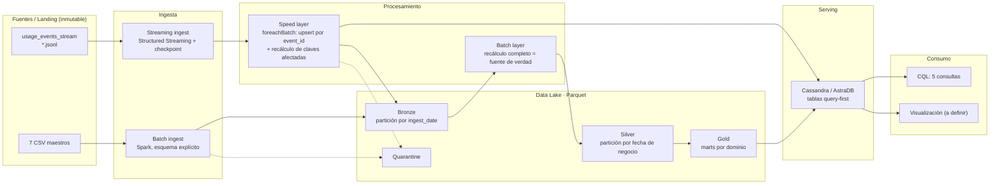

# ISTEA_Mineria_de_datos_II

# Cloud Provider Analytics — Estado consolidado del proyecto

**Minería de Datos II · ISTEA · 2C 2026 · Prof. Diego Mosquera**
**Fecha de corte:** 2026-10-03 · **Próxima entrega:** miércoles 07/10/2026, 19:00 h (primera evaluación parcial)

---

## 1. Resumen ejecutivo

- **Caso:** pipeline de datos para un proveedor de nube que sirve a FinOps, Soporte y Producto. Stack: PySpark + Structured Streaming + Parquet + Cassandra/AstraDB, ejecutable en Colab.
- **Hecho:** perfilado completo de las 8 fuentes con PySpark (notebook ejecutado y validado en Colab), interpretación del problema, análisis 5V, arquitectura v0, selección de patrón (Lambda) y diseño del Data Lake.
- **Hallazgo central:** los archivos de eventos no llegan ordenados en el tiempo (cada uno cubre ~60 días). Eso invalida un streaming "de manual" con watermark corto (el 99% de los eventos sería descartado) y fundamenta tanto la elección de Lambda como la partición de Bronze por fecha de llegada.
- **Avance estimado contra la rúbrica de la primera entrega:** ~65%. Faltan la matriz requisito-componente, los flujos por fuente, el MapReduce, riesgos y esfuerzo, el repositorio y la consolidación del documento de diseño.

---

## 2. Calendario

| Instancia | Fecha y hora límite | Foco |
|---|---|---|
| Primera entrega | Mié 07/10/2026 · 19:00 h | Diseño y fundación de datos |
| Segunda entrega | Mié 18/11/2026 · 19:00 h | Pipeline ejecutable Landing → Bronze → Silver → Gold → AstraDB |
| Recuperatorio | Mié 02/12/2026 · 19:00 a 21:00 h | Parcial no aprobado |
| Evaluación final | Mié 09/12/2026 · 19:00 a 21:00 h | MVP integrado, video, presentación y defensa |

Regla de corte: se evalúa lo que esté en el repositorio a la hora límite.

---

## 3. Artefactos generados

| Archivo | Contenido | Punto de la entrega 1 |
|---|---|---|
| `01_perfilado_fuentes.ipynb` | Perfilado de las 8 fuentes, simulación del watermark, inventario y síntesis de implicancias. Ejecutado y validado en Colab | 3, 12 (evidencia) |
| `02_diseno_v0_problema_5v_arquitectura.md` | Problema, usuarios, objetivos medibles, 5V, arquitectura v0 (Mermaid), patrón | 1, 2, 4, 5 |
| `03_diseno_data_lake.md` | Zonas, naming, particionamiento medido, formatos, reglas de promoción, catálogo de 16 reglas de calidad, metadatos, retención, seguridad | 7 |
| `00_proyecto_cpa_estado_consolidado.md` | Este documento | — |

**Entorno:** el notebook usa PySpark 3.5/4.x. En Colab, los datos se leen desde Drive (`/content/drive/MyDrive/cpa/landing`), y hay que montar Drive antes con `drive.mount('/content/drive')`.

---

## 4. Estado de la primera entrega

| # | Punto | Estado | Artefacto |
|---|---|---|---|
| 1 | Problema, usuarios, preguntas, objetivos medibles | Borrador hecho | 02 |
| 2 | Justificación con 5V | Borrador hecho | 02 |
| 3 | Inventario y perfil de fuentes | **Hecho** | 01 |
| 4 | Diagrama de arquitectura | v0 hecho; falta v1 con detalle del lago y verificar render | 02 |
| 5 | Patrón justificado | **Hecho** (Lambda) | 02 |
| 6 | Matriz requisito → componente | Pendiente | — |
| 7 | Diseño del Data Lake | **Hecho** | 03 |
| 8 | Flujos batch y streaming con herramientas | Parcial (a nivel capas; falta el recorrido por fuente) | 02 |
| 9 | Flujo batch en MapReduce | Pendiente | — |
| 10 | Supuestos, riesgos, mitigaciones | Parcial (hallazgos y preguntas abiertas; falta tabla formal) | 01, 02, 03 |
| 11 | Esfuerzo, roles y recursos | Pendiente (requiere definir integrantes y reparto) | — |
| 12 | Repo con README y evidencia | Parcial (el notebook existe; el repo no) | 01 |

| Artefacto exigido | Estado |
|---|---|
| Documento de diseño | En partes (02 y 03); falta consolidar |
| Repositorio | No creado |
| Diagrama de arquitectura v1 | v0 |
| Matriz requisito-componente | Pendiente |
| Plan inicial (supuestos, riesgos, esfuerzo, próximos pasos) | Pendiente |

---

## 5. Fuentes: inventario y hallazgos del perfilado

| Fuente | Grano | Clave | Filas | Modo | Riesgos de calidad |
|---|---|---|---|---|---|
| `customers_orgs.csv` | Org | `org_id` | 80 | Batch (maestro) | `nps_score` nulo 14% y 1 fuera de rango; `plan_tier` vs `is_enterprise` inconsistente (25 orgs) |
| `users.csv` | Usuario | `user_id` | 800 | Batch (maestro) | `last_login < created_at` (232); usuarios previos al signup de la org (249); `email` es PII |
| `resources.csv` | Recurso | `resource_id` | 400 | Batch (maestro) | `tags_json` 0% parseable (doble escape y truncado) |
| `support_tickets.csv` | Ticket | `ticket_id` | 1.000 | Batch (diario) | `csat` nulo 25%; `resolved_at` nulo = abierto (24%); SLA invertido por severidad |
| `marketing_touches.csv` | Interacción | `touch_id` | 1.500 | Batch (diario) | Limpio |
| `nps_surveys.csv` | Encuesta | `org_id + survey_date` | 92 | Batch (periódico) | `nps_score` nulo 21%; cubre 60 de 80 orgs |
| `billing_monthly.csv` | Factura | `invoice_id` | 240 | Batch (mensual) | 13 subtotales negativos; **las 160 filas USD con FX ≠ 1**; 50 de 80 orgs con más de una moneda; `credits` nulo 57% |
| `usage_events_stream/*.jsonl` | Evento | `event_id` | 43.200 | Streaming | Schema v1/v2; `unit` nulo con `value` 4,7%; 216 costos negativos; 48 spikes > 100 USD; archivos desordenados en el tiempo |

### 5.1 Eventos de uso
- 120 archivos de 360 eventos; 80 orgs, 400 recursos; 03/07 a 31/08/2025; 720 eventos por día.
- **Evolución de esquema con corte limpio:** v1 del 03/07 al 17/07 (10.800), v2 del 18/07 al 31/08 (32.400). `carbon_kg` en el 100% de v2; `genai_tokens` solo en genai v2.
- **Sin tipos ambiguos ni duplicados** en la muestra, aunque la consigna los anuncia. Se implementan igual; la idempotencia se prueba por reproceso o inyección.
- **Costos:** escala ~10× distinta entre servicios (mediana networking 0,19 vs genai 2,04) → anomalías por servicio.
- Integridad referencial perfecta con los maestros.

### 5.2 Simulación de watermark (un archivo por micro-lote)

| Watermark | Eventos tardíos |
|---|---|
| 1 hora | 99,1% |
| 1 día | 97,5% |
| 7 días | 87,6% |
| 30 días | 49,6% |
| 60 días | 0% |

El watermark solo descarta en operadores con estado; un append a Bronze no pierde datos.

### 5.3 Particionamiento medido
- JSONL 12,9 MB → Parquet 2,1 MB (~6×).
- Por `event_date` con repartition: 60 archivos de ~35 KB. Por fecha + servicio: 360 de ~10 KB. Por mes: 2 de ~830 KB.
- Cada archivo de eventos contiene 59 a 60 fechas distintas → particionar Bronze por `event_date` en streaming generaría ~7.200 archivos de <1 KB.

---

## 6. Diseño

### 6.1 Problema y usuarios

| Usuario | Mart Gold | Consulta obligatoria |
|---|---|---|
| FinOps | `org_daily_usage_by_service` | Q1 costos y requests diarios por org y servicio; Q2 top-N servicios por costo, últimos 14 días |
| FinOps | `revenue_by_org_month` | Q4 revenue mensual con créditos e impuestos en USD |
| FinOps | `cost_anomaly_mart` | Contexto de anomalías para Q1/Q2 |
| Soporte | `tickets_by_org_date` | Q3 tickets críticos y SLA breach rate, últimos 30 días |
| Producto / GenAI | `genai_tokens_by_org_date` | Q5 tokens GenAI y costo estimado por día |

### 6.2 Objetivos medibles

| # | Objetivo | Verificación |
|---|---|---|
| O1 | Completitud de ingesta | Landing = Bronze + Quarantine (+ duplicados descartados) |
| O2 | Idempotencia | Reproceso completo con 0 duplicados |
| O3 | Frescura | Evento disponible en Bronze/Silver dentro de 1 micro-batch |
| O4 | Calidad trazable | 100% evaluado; quarantine con motivo; tasa por corrida |
| O5 | Compatibilidad de esquema | v1 y v2 unificados en Silver |
| O6 | Serving query-first | Cada consulta lee una partición, sin `ALLOW FILTERING` |
| O7 | Reproducibilidad | Corre desde entorno limpio con el Quickstart |

### 6.3 5V

| V | Peso | Decisión que dispara |
|---|---|---|
| Velocidad | Dominante | Structured Streaming + checkpoint; dedupe sin depender del watermark; Lambda |
| Veracidad | Dominante | Reglas de calidad, quarantine, flags, imputación documentada |
| Variedad | Media | Esquemas explícitos, unificación v1/v2, `schema_version` |
| Valor | Alto | Marts por dominio; serving modelado desde las 5 consultas |
| Volumen | Bajo hoy | No se usa como argumento; el diseño escala horizontalmente |

### 6.4 Arquitectura v0

Capacidades transversales: calidad, metadatos, linaje, seguridad, observabilidad (detalle en 03).

### 6.5 Patrón: Lambda
- **Speed layer:** `foreachBatch` con upsert idempotente por `event_id` y recálculo solo de las claves `(org, fecha, servicio)` afectadas. Cumple near real-time sin depender del watermark.
- **Batch layer:** recálculo completo por event-time; es la fuente de verdad y procesa los maestros a su ritmo.
- **Mitigación de la doble lógica:** transformaciones en un único módulo Python compartido por ambas capas.
- **Descartados:** solo batch (no cumple el requisito invariable), Kappa (exige watermark de ~60 días o reprocesar todo; los maestros mensuales no ganan nada como stream), híbrido ad hoc (difícil de justificar).

### 6.6 Data Lake (síntesis de 03)

| Zona | Formato | Partición | Escritura |
|---|---|---|---|
| Landing | CSV / JSONL | — | Inmutable |
| Bronze | Parquet + Snappy | `ingest_date` | Append con dedupe por clave |
| Quarantine | Parquet | `ingest_date` | Append, registro original + regla + corrida |
| Silver | Parquet + Snappy | Fecha de negocio (`event_date`, `created_date`, `billing_month`); dimensiones sin partición | Overwrite dinámico por partición |
| Gold | Parquet + Snappy | Fecha o mes del mart | Overwrite dinámico por partición |
| `_meta` | Parquet | — | Log de corridas y resultados de calidad |

- **Columnas técnicas:** `ingest_ts`, `source_file`, `run_id`, `schema_version`. **Flags:** prefijo `dq_`.
- **Silver:** `fct_usage_events`, `fct_support_tickets`, `fct_billing_monthly`, `fct_nps_surveys`, `fct_marketing_touches`, `dim_org` (preparada para SCD tipo 2), `dim_user`, `dim_resource`.
- **Promoción a Gold:** integridad referencial, reconciliación de totales Silver = Gold, unicidad del grano, corrida de Silver en estado OK.
- **PII:** `users.email`, `customers_orgs.sales_rep`, recursos con `pii:true`. No llegan a Gold.

### 6.7 Catálogo de calidad (resumen)
Criterio: **quarantine** lo inutilizable, **flag** lo dudoso pero útil, **imputación con flag** lo determinístico.

| Acción | Reglas |
|---|---|
| Quarantine | `event_id` nulo, `timestamp` no parseable, claves huérfanas, `schema_version` inválido, `resolved_at < created_at` |
| Dedupe | `event_id` repetido |
| Flag | Costo < −0,01 (211), subtotal negativo (13), créditos fuera de rango (9), incoherencias temporales en users (232 / 249), `plan_tier` vs `is_enterprise` (25), NPS fuera de rango (1) |
| Imputación + flag | `unit` desde `metric` (2.038), `credits` nulo → 0 (137), FX = 1 en USD (160) |
| Extracción | `tags_json` por regex (317) |

---

## 7. Registro de decisiones

| ID | Decisión | Alternativas descartadas | Evidencia |
|---|---|---|---|
| D-01 | Perfilado y pipeline en PySpark | pandas | Alineación con la materia; reutilización de esquemas en Bronze |
| D-02 | Leer CSV como string y castear con `try_cast` | `inferSchema` | Mide casteabilidad real; compatible con Spark 3.5 y 4.x (ANSI) |
| D-03 | Patrón Lambda con speed layer sin dependencia del watermark | Kappa, solo batch, watermark de 60 días | Simulación: 99% de eventos tardíos con watermark de 1 h |
| D-04 | Bronze de eventos particionado por `ingest_date` | Por `event_date`, por fecha + servicio | ~60 fechas por archivo → ~7.200 archivos minúsculos |
| D-05 | Silver de eventos por `event_date`, 1 archivo por partición | Por mes, por fecha + servicio | Escala sana a 1.000× (~35 MB por partición) |
| D-06 | Parquet + Snappy en todas las zonas procesadas | Avro, ORC, Delta | Columnar, compresión 6× medida, requerido por la consigna |
| D-07 | Imputar `unit` desde `metric` con flag | Quarantine | Relación 1:1; evita perder el 4,7% de los eventos |
| D-08 | Anomalías de costo por servicio | Umbral global | Escala ~10× distinta entre servicios |
| D-09 | `tags_json` por regex | `from_json` | 0% parseable como JSON |
| D-10 | Volumen declarado como bajo en el análisis 5V | Forzar el argumento de volumen | 13 MB no sostiene el argumento; se justifica por velocidad y veracidad |
| D-11 | Fuente de verdad de segmento: `plan_tier` | `is_enterprise` | 25 inconsistencias |

---

## 8. Preguntas abiertas

**Para el profesor:**
1. ¿El desorden temporal de los archivos de eventos es intencional?
2. Subtotales negativos en billing: ¿notas de crédito válidas o error?
3. `exchange_rate_to_usd` ≠ 1 en todas las filas USD: ¿qué valor prevalece?
4. Escala de `csat` (observado 0 a 7).

**Para el equipo:**
1. Alcance de la speed layer: solo Bronze, o también recálculo incremental de Gold y AstraDB.
2. Ubicación del lago: Drive compartido o local por integrante.
3. Herramienta de visualización.
4. Repositorio: responsable y estructura (consigna, sección 8.1).
5. Reparto de roles (insumo del punto 11).

---

## 9. Próximos pasos hacia la entrega 1

1. Flujos por fuente (punto 8) y diagrama v1 (punto 4).
2. MapReduce del mart `org_daily_usage_by_service` (punto 9).
3. Matriz requisito → componente (punto 6).
4. Tabla de riesgos y mitigaciones (punto 10) y estimación de esfuerzo (punto 11).
5. Repositorio con README, DECISIONS.md y la estructura de la consigna (punto 12).
6. Consolidar el documento de diseño único y revisar contra la checklist 9.1.

**Opcional, adelanta la entrega 2:** notebook `02_ingesta_bronze.ipynb` (estructura de zonas, ingesta batch y streaming a Bronze, quarantine, log de corridas) y alta de la cuenta de AstraDB.
